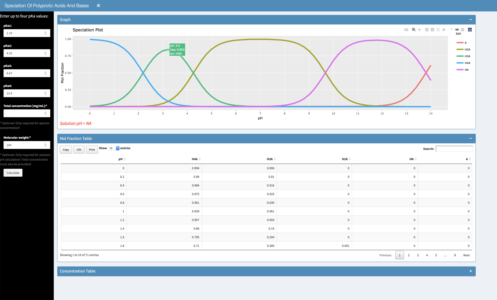

# speciation_chemical
This repository hosts an interactive RShiny app designed for calculating the speciation of polyprotic acids and bases using their pKa values. The app also tabulate the mole fraction and concentration of the ion species at a given solution pH. 
The app also offers an interactive plot to visualize the speciation as a function of pH. Intuitive visualization of the speciation trends across the pH range is also provided via an interactive Plotly plot. 

